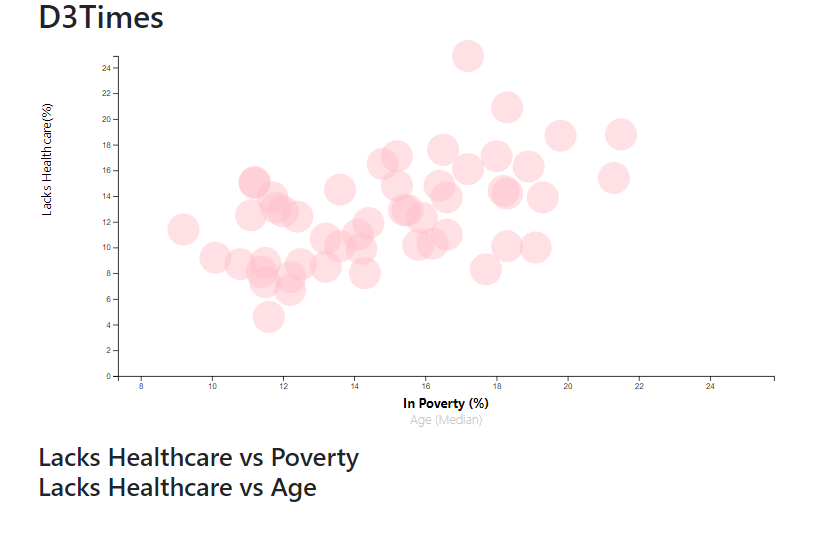

# D3 -challenge - Data Journalism and D3

## Summary ##
This project is to use D3.js to create an interactive chart and display it on HTML. 
Chart contains: 
    - y-axis: Lacks Healthcare(%) 
    - dual x-axis: Poverty (%)
                 Age(Median)

## Data ##
D3_data-journalism/StarterCode/assets/data/data.csv
## Tool ##
JavaScript, HTML, CSS
## Visualization ##
